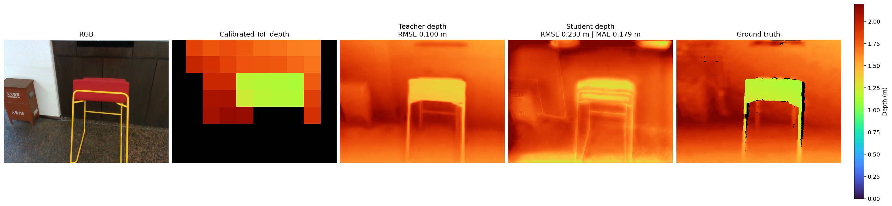
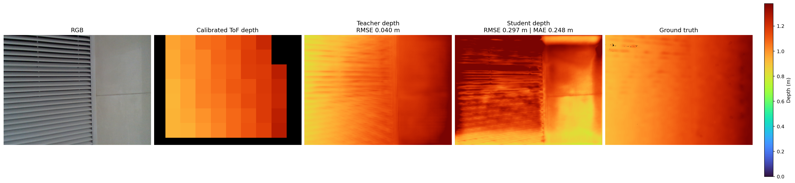

# Calibrated-ToF depth refinement: v5 and v4

This project predicts a dense 480×640 metric-depth map from an RGB image and
an 8×8 calibrated ToF measurement. **Use v5 for the main experiments and
deployment. Use v4 only as the comparison method.**

## Test results

The following images are qualitative test results. Each row shows the RGB
input, calibrated ToF depth, teacher prediction, v5 student prediction, and
ground-truth depth. The prediction panels include the per-image error.





## Methods at a glance

| Method | Purpose | RGB encoder | Parameters | Configuration |
| --- | --- | --- | ---: | --- |
| **v5** | Recommended method | EfficientFormerV2-S0, trained from scratch | 3,393,614 | `configs/student_v5.yml` |
| **v4** | Lightweight comparison | Depthwise-separable four-stage encoder | 141,694 | `configs/student_v4.yml` |

Both students:

- accept a normalized RGB image and 64 calibrated ToF tokens;
- fuse RGB and ToF features at the 1/16 and 1/8 scales;
- return a 480×640 metric-depth map;
- train with the same frozen v4 teacher and the same scene-disjoint data split;
- can be evaluated, benchmarked, and exported with the same tools.

This shared setup makes v4 a controlled comparison for the v5 encoder and
decoder design.

## Method

### Calibrated RGB/ToF input

For ToF zone `i`, the ZJU-L5 sample provides:

- `hist_data[i]`: mean depth and standard deviation;
- `mask[i]`: measurement validity;
- `fr[i] = [top, left, bottom, right]`: the zone footprint in RGB pixels.

The rectangle uses half-open indexing: `rgb[top:bottom, left:right]`. The data
pipeline clips each rectangle to the RGB frame and creates one token per zone:

```text
[mean, standard_deviation, valid, center_y, center_x, height, width]
```

The center and size values are normalized by the RGB height and width. During
fusion, RGB locations query the valid ToF tokens. A smooth geometric bias gives
more weight to zones whose calibrated rectangles are close to the RGB query,
while still allowing global attention. See
[RGB and calibrated-ToF alignment](docs/tof_rgb_alignment.md) for the equations
and augmentation rules.

### v5: recommended method

v5 uses an EfficientFormerV2-S0 semantic encoder initialized with random
weights; it does not load ImageNet weights. The semantic branch processes RGB
at 256×320 and produces four feature scales. A shallow RGB detail branch
produces a 1/4-scale skip, and the final depth head reuses full-resolution RGB.
Calibrated ToF cross-attention is applied at 1/16 and 1/8 resolution before the
decoder reconstructs the 480×640 depth map.

```text
RGB ─┬─> scratch EfficientFormerV2-S0 ─> multi-scale RGB features ─┐
     └─> shallow detail encoder ──────────> 1/4 RGB skip ────┤
64 calibrated ToF tokens ─> geometry-aware fusion at 1/16 and 1/8 ─┘
                                                                    |
                                                               decoder
                                                                    |
                                                full-resolution RGB refine
                                                                    |
                                                     metric depth 480×640
```

The default v5 training schedule is:

1. Epochs 1–5: ground-truth supervision only; the teacher is not executed.
2. Epochs 6–9: linearly increase teacher depth and feature supervision.
3. Epoch 10 onward: use the full distillation weights.

The objective combines masked metric-depth MSE, a multi-scale log-depth
gradient loss, confidence-weighted teacher depth supervision, and feature
distillation. Teacher confidence reduces unreliable teacher gradients, and
pixels outside valid ToF coverage receive additional supervision weight.

The full v5 experiment specification is in
[the v5 implementation plan](plans/student_v5_efficientformer_implementation_plan.md).

### v4: comparison method

v4 uses a much smaller depthwise-separable RGB encoder with channel widths
`[32, 64, 96, 128]`. It uses the same calibrated tokens, appearance pooling,
geometry-aware attention, fusion scales, teacher, training schedule, and output
resolution as v5. Its 141,694-parameter size makes it the lightweight
comparison for accuracy, latency, and memory measurements.

The shared v4 teacher uses a frozen pretrained Depth Anything V2 Large RGB
backbone plus trainable RGB projections, calibrated-ToF fusion blocks, a
decoder, and a metric-depth head. The teacher is trained once, then frozen for
both student experiments. It is not part of either exported student.

More detail about the teacher/student design is available in
[the architecture plan](docs/teacher_student_architecture_plan.md).

## Setup

Create an environment and install the student dependencies:

```bash
python -m venv .venv
source .venv/bin/activate
python -m pip install --upgrade pip
python -m pip install -r requirements.txt
```

Training the shared teacher, or comparing a student with the teacher during
evaluation, also requires:

```bash
python -m pip install -r requirements-teacher.txt
```

The teacher downloads its pretrained backbone on first use. To require an
already cached backbone instead, set `local_files_only: true` in
`configs/teacher_v4.yml` and in the `teacher_model` section of each student
configuration.

## Dataset configuration

Download ZJU-L5 and update `data.root` in these files:

- `configs/teacher_v4.yml`;
- `configs/student_v5.yml`;
- `configs/student_v5_supervised.yml` if running the ground-truth-only control;
- `configs/student_v4.yml` when running the v4 comparison.

`data.root` must contain the scene directories referenced by `data.json`. The
loader resolves a relative `data.manifest` from `data.root`, so either copy the
repository's `data.json` into the dataset root or set `data.manifest` to its
absolute path. For example:

```yaml
data:
  root: /path/to/ZJUL5
  manifest: /path/to/depth_refine/data.json
```

Each HDF5 sample must contain `rgb`, `depth`, `hist_data`, `fr`, and `mask`.
The supplied manifest defines scene-disjoint splits:

| Split | Samples | Scenes |
| --- | ---: | --- |
| Train | 707 | cafe1, cafe2, classroom, dinner_room1, lab1, lab2, leisure_area, library1, supermarket, teaching_region |
| Validation | 101 | library2 |
| Test | 202 | dinner_room2, dorm, showroom, theater |

## v5 quick start

Run these commands from the repository root.

### 1. Check the v5 model and data

Print the model size without starting training:

```bash
python main.py --config configs/student_v5.yml --para-summary
```

The expected result is 3,393,614 trainable parameters and about 6.47 MiB of
FP16 parameter storage. After configuring the dataset, inspect one real batch:

```bash
python main.py --config configs/student_v5.yml
```

To perform a short training check, temporarily set
`training.max_train_batches: 1`, `training.max_validation_batches: 1`, and
`training.epochs: 1` in a copy of the v5 configuration.

### 2. Train the shared v4 teacher

The student configuration expects `checkpoints_teacher_v4/best.pt`. If that
file does not exist, train the teacher first:

```bash
python train.py --config configs/teacher_v4.yml
```

The best validation checkpoint is saved to
`checkpoints_teacher_v4/best.pt`. To resume an interrupted teacher run:

```bash
python train.py \
  --config configs/teacher_v4.yml \
  --resume checkpoints_teacher_v4/depth_refinement_epoch_010.pt \
  --epochs 30
```

### 3. Train v5

```bash
python train.py --config configs/student_v5.yml
```

Checkpoints are written to `checkpoints_student_v5/`; the best validation
checkpoint is `checkpoints_student_v5/best.pt`. Monitor training with:

```bash
tensorboard --logdir runs/student_v5
```

Resume from a saved epoch while keeping the total target at 60 epochs:

```bash
python train.py \
  --config configs/student_v5.yml \
  --resume checkpoints_student_v5/depth_refinement_epoch_015.pt \
  --epochs 60
```

For the ground-truth-only v5 control, use:

```bash
python train.py --config configs/student_v5_supervised.yml
```

### 4. Evaluate v5

Use the validation split while developing:

```bash
python eval.py \
  --config configs/student_v5.yml \
  --checkpoint checkpoints_student_v5/best.pt \
  --split val
```

The v5 configuration compares the student and frozen teacher on the same
batches by default. It prints both pooled RMSE values. Add `--visualize` to
save aligned RGB, calibrated ToF, teacher depth, student depth, and
ground-truth panels:

```bash
python eval.py \
  --config configs/student_v5.yml \
  --checkpoint checkpoints_student_v5/best.pt \
  --split val \
  --visualize
```

Use `--no-compare-teacher` for student-only evaluation. This avoids loading
the teacher and its optional dependencies:

```bash
python eval.py \
  --config configs/student_v5.yml \
  --checkpoint checkpoints_student_v5/best.pt \
  --split val \
  --no-compare-teacher
```

Reserve the test split for the final result by changing `--split val` to
`--split test`.

The evaluator reports pooled and image-averaged RMSE, MAE, AbsRel, and
δ1, together with depth-bin, inside/outside-ToF-coverage, and boundary
metrics. Target values outside the configured `[min_depth, max_depth]` range
are excluded.

### 5. Benchmark v5

```bash
python benchmark_student.py \
  --config configs/student_v5.yml \
  --checkpoint checkpoints_student_v5/best.pt \
  --device cuda
```

The benchmark reports model-only p50/p95 latency, throughput, parameter size,
and CUDA peak allocation when CUDA is selected. These are local PyTorch
measurements; deployment latency must be measured again on the target runtime
and device.

### 6. Export v5

```bash
python export_student.py \
  --config configs/student_v5.yml \
  --checkpoint checkpoints_student_v5/best.pt \
  --output student_v5_480x640.pt
```

The exporter creates a fixed-resolution TorchScript graph and checks eager vs.
TorchScript output parity before writing the file. The teacher and
training-only feature adapters are not included.

## Run the v4 comparison

Use the same trained teacher checkpoint and dataset split as v5.

```bash
# Inspect and train the comparison student.
python main.py --config configs/student_v4.yml --para-summary
python train.py --config configs/student_v4.yml

# Evaluate it on the same final split used for v5.
python eval.py \
  --config configs/student_v4.yml \
  --checkpoint checkpoints_student_v4/best.pt \
  --split test \
  --visualize

# Measure it under the same device and benchmark settings used for v5.
python benchmark_student.py \
  --config configs/student_v4.yml \
  --checkpoint checkpoints_student_v4/best.pt \
  --device cuda

# Export the comparison artifact.
python export_student.py \
  --config configs/student_v4.yml \
  --checkpoint checkpoints_student_v4/best.pt \
  --output student_v4_480x640.pt
```

For a fair comparison, do not change the manifest, data range, evaluation
split, teacher checkpoint, or benchmark warmup/iteration counts between v4
and v5. Report accuracy together with parameter count, latency, and peak
memory.

## Student inference interface

Both students use the same inference call:

```python
depth = student(image, tof_tokens)
```

Expected tensor shapes are:

| Tensor | Shape | Meaning |
| --- | --- | --- |
| `image` | `B×3×480×640` | normalized RGB |
| `tof_tokens` | `B×64×7` | ToF mean, standard deviation, validity, and normalized rectangle geometry |
| `depth` | `B×1×480×640` | predicted metric depth |

During training, `student(image, tof_tokens, return_aux=True)` also returns
the intermediate features required for distillation.

## Tests

Run the test suite from the repository root:

```bash
python -m pip install pytest
python -m pytest -q
```
