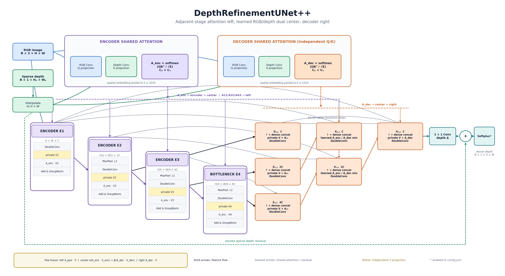
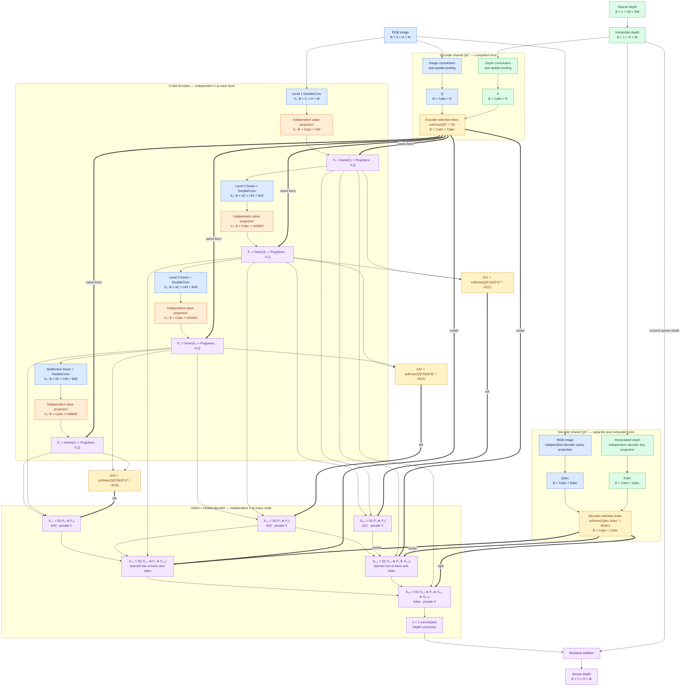

# Depth Refinement Model

This model takes an RGB image and a lower-resolution sparse depth map and
produces a dense depth map at the image resolution.

## Environment setup

A project-local `.venv` is already created and excluded from Git. Activate it:

```bash
cd /home/himwong/Desktop/depth_refine
source .venv/bin/activate
python -m pip install -r requirements.txt
```

To recreate the environment from scratch:

```bash
cd /home/himwong/Desktop/depth_refine
python3 -m venv .venv
source .venv/bin/activate
python -m pip install --upgrade pip
python -m pip install -r requirements.txt
```

Verify that the model and dataset can be constructed before training:

```bash
python main.py
```

## Architecture

The model creates two RGB/depth `QKᵀ` channel-attention matrices plus three
adjacent-encoder feature matrices. `Aenc` is shared by the encoder levels;
`Adec` uses independent RGB/depth projections. For the nested decoder's left
column, `A21`, `A32`, and `A43` are computed from successive encoder feature
pairs and routed to the matching resolution. The center learns a mixture of
`Aenc` and `Adec`, while the right column uses `Adec`. Every location owns its
value and output projections.

### Publication-style architecture figure



The diagram is available as an editable
[SVG](docs/depth_refinement_architecture.svg) and a high-resolution
[PNG](docs/depth_refinement_architecture.png). Regenerate both from the current
architecture drawing source with:

```bash
source .venv/bin/activate
python draw_architecture.py
```

The solid paths show feature flow, dashed purple/orange paths show shared
RGB/depth attention, and the left decoder nodes identify their adjacent-stage
attention matrices.



The attention operations are:

```text
Qenc = image embedding              # B × Cattn × E
Kenc = depth embedding              # B × Cattn × E
Aenc = softmax(Qenc Kencᵀ / √E)     # encoder matrix, computed once

V₁ = value_projection₁(X₁)          # independent weights
V₂ = value_projection₂(X₂)          # independent weights
V₃ = value_projection₃(X₃)          # independent weights
V₄ = value_projection₄(X₄)          # independent weights

Fᵢ = GroupNorm(Xᵢ + output_projectionᵢ(Aenc · Vᵢ))

A21 = softmax(Q(F₁↓F₂) K(F₂)ᵀ / √E21)
A32 = softmax(Q(F₂↓F₃) K(F₃)ᵀ / √E32)
A43 = softmax(Q(F₃↓F₄) K(F₄)ᵀ / √E43)

Qdec = decoder_image_embedding(RGB)          # independent decoder Q weights
Kdec = decoder_depth_embedding(resized_depth)# independent decoder K weights
Adec = softmax(Qdec Kdecᵀ / √Edec)           # decoder matrix, computed once

Cᵢⱼ = concat(upsample(Xᵢ₊₁,ⱼ₋₁), Xᵢ,₀, ..., Xᵢ,ⱼ₋₁)
Left₀(C) = GroupNorm(C + W21(A21 · V21(C)))
Left₁(C) = GroupNorm(C + W32(A32 · V32(C)))
Left₂(C) = GroupNorm(C + W43(A43 · V43(C)))
Right(C) = GroupNorm(C + Wdec(Adec · Vdec(C)))
Center(C) = GroupNorm(C + α Wenc(Aenc · Venc(C))
                         + β Wdec(Adec · Vdec(C)))
[α, β] = softmax(learned logits)  # initialized to [0.5, 0.5]
Xᵢⱼ = DoubleConvᵢⱼ(Route(Cᵢⱼ))
```

Encoder channel widths follow `C → 2C → 4C → 8C`, where `C` is
`model.base_channels`. Dense UNet++ skip paths connect every earlier node at a
resolution to the next nested decoder node. Attention value projections use
`model.attention_channels`. `model.max_attention_tokens` caps the embedding
length for every Q/K matrix. With `model.decoder_attention: false`, adjacent
encoder-pair attention still drives the left column, the center uses `Aenc`,
and the right node runs without attention fusion.

The nested decoder changes parameter names and concatenation widths, so
checkpoints from the earlier plain U-Net are not compatible. Train this
architecture from scratch.

## Configuration

Model and summary settings are controlled by [`config.yml`](config.yml). Run:

```bash
python main.py
```

To use another configuration:

```bash
python main.py --config path/to/config.yml
```

For the smaller iPhone-oriented variant, set both `base_channels` and
`attention_channels` to `16`. Set `summary.parameter_dtype` to `float16` to
report the expected FP16 weight size.

## ZJU-L5 DataLoader

The `data` section of [`config.yml`](config.yml) controls the ZJU-L5 input
pipeline. `main.py` builds the DataLoader after loading the configuration and
reports the first batch. Each batch contains:

- `image`: normalized RGB tensor, `[B, 3, 480, 640]`.
- `sparse_depth`: valid ToF mean depths, `[B, 1, 8, 8]`.
- `target_depth`: high-resolution target depth clamped to `0.1`-`10.0 m`,
  `[B, 1, 480, 640]`.
- `sparse_valid_mask`: validity of the 64 ToF zones.
- `target_valid_mask`: validity of high-resolution depth pixels.
- `path`: source HDF5 path relative to the dataset root.

The manifest uses a scene-level 70/10/20 split across all 1,010 schema-compatible
HDF5 samples, so nearby frames from one scene cannot leak between training and
evaluation:

| Split | Samples | Scenes |
| --- | ---: | --- |
| Train | 707 | cafe1, cafe2, classroom, dinner_room1, lab1, lab2, leisure_area, library1, supermarket, teaching_region |
| Validation | 101 | library2 |
| Test | 202 | dinner_room2, dorm, showroom, theater |

Training shuffles and consumes the full `train` split each epoch. Validation
uses the complete `val` split, while `eval.py` defaults to the `test` split.
Eleven legacy files are deliberately excluded because they contain `tof`
instead of the `hist_data` and `mask` datasets required by this input pipeline.

Inspect a batch with:

```bash
python main.py
```

## Training

Training is handled by `train.py`. `main.py` only validates the configuration,
constructs the model, and inspects one dataset batch.

### Train/validation/test workflow

The three splits have separate roles:

1. `train` updates model weights. `train.py` always uses this split and shuffles
   it, regardless of the inspection value in `data.split`.
2. `val` never updates weights. It measures generalization, provides the
   TensorBoard validation curves and samples, and selects `best.pt` using the
   lowest validation RMSE.
3. `test` is not read during normal training. After training decisions are
   complete, run `eval.py` once on `best.pt` for the final performance estimate.

For compatibility with an older `data.json` containing only `train` and `test`,
`train.py` emits a warning and uses `test` as the validation fallback. In that
case, test data influences model selection, so its result is no longer an
unbiased final performance estimate. The current manifest has a dedicated
`val` split and does not use this fallback.

Before starting, check these sections in [`config.yml`](config.yml):

```yaml
model:
  # Use 16 for a lighter model or 32 for the default model.
  base_channels: 16
  attention_channels: 16
  decoder_attention: true
  positive_output: true

data:
  root: /home/himwong/Downloads/ZJUL5/ZJUL5
  split: train
  batch_size: 1
  num_workers: 0

training:
  device: auto             # CUDA, MPS, or CPU is selected automatically
  epochs: 60
  learning_rate: 0.0003
  lr_scheduler: cosine
  warmup_epochs: 3
  warmup_start_factor: 0.1
  minimum_learning_rate: 0.000001
  loss: scale_invariant
  scale_invariant_lambda: 0.85
  scale_invariant_alpha: 10.0
  minimum_depth: 0.001
  amp: true                # used on CUDA only
  validation_split: val
  tensorboard:
    enabled: true
    log_dir: runs/depth_refinement
    image_every: 1
    num_images: 2
    depth_min: 0.0
    depth_max: null
  checkpoint_dir: checkpoints
  save_every: 5
```

Start training:

```bash
source .venv/bin/activate
python train.py
```

### TensorBoard

TensorBoard logging is enabled by default. Event files are written to
`runs/depth_refinement/` and contain:

- `Loss/train`: mean training loss for each epoch.
- `Loss/validation`: mean validation loss using the configured loss function.
- `Metrics/validation_MAE` and `Metrics/validation_RMSE` in meters.
- `Learning_rate/epoch`: the learning rate used during that epoch.
- `Overfitting/validation_minus_train_loss`: the validation–training loss gap.
- `Overfitting/validation_to_train_loss_ratio`: the validation/training ratio.
- `Workflow/data_splits`: records the actual split selection, including whether
  the legacy `test_fallback` was activated.
- `Samples/val_*`: RGB, sparse depth, refined depth, and ground-truth
  panels generated with the same renderer as `eval.py`.

Start the TensorBoard web interface in another terminal while training runs:

```bash
source .venv/bin/activate
tensorboard --logdir runs/depth_refinement
```

Then open `http://localhost:6006`. `image_every` controls the sampling interval,
and `num_images` controls how many validation samples are written each time.
When `depth_max` is `null`, each panel uses the 99th percentile of its valid
ground truth as the upper color limit. Set `training.tensorboard.enabled` to
`false` to disable event logging. The `runs/` directory is ignored by Git.

Use the TensorBoard **Train vs validation loss** chart to monitor overfitting.
A validation loss that stops improving while training loss continues downward,
especially with a growing positive gap or ratio, is evidence of overfitting.
Use `best.pt` from the lowest validation RMSE rather than the final epoch when
this occurs.

The default loss follows DELTAR Equation 4: a scaled scale-invariant loss over
the logarithmic difference between predicted and target depth. It uses
`lambda = 0.85` and `alpha = 10`, ignores zero and non-finite target pixels,
and clamps valid depths to at least `0.001 m` before taking logarithms. Positive
model output is therefore enabled. At each configured save interval, a
checkpoint containing the model, optimizer, epoch, and training configuration
is written to `checkpoints/`. Validation reports the configured validation loss,
masked MAE, and masked RMSE.

The default learning-rate schedule linearly warms up from 10% to 100% of the
configured learning rate over three epochs, then uses cosine decay down to
`0.000001`. Set `lr_scheduler: none` to use a fixed learning rate.

The checkpoint with the lowest validation RMSE is also saved as:

```text
checkpoints/best.pt
```

Epoch checkpoints contain the model, optimizer, learning-rate scheduler, CUDA
AMP scaler, completed epoch, and best-validation state. Resume from one while
setting the total target epoch count with:

```bash
python train.py \
  --resume checkpoints/depth_refinement_epoch_010.pt \
  --epochs 30
```

This starts at epoch 11 and continues through epoch 30. You can also resume
from `checkpoints/best.pt`. Alternatively, set `training.resume_from` and
`training.epochs` in `config.yml`.

### Pipeline smoke test

Before a long run, temporarily use the following settings:

```yaml
training:
  device: cpu
  epochs: 1
  max_train_batches: 1
  max_validation_batches: 1
```

Then run:

```bash
python train.py
```

After the single train and validation batches complete successfully, restore
`device: auto`, the desired epoch count, and both `max_*_batches` values to
`null`. You can inspect the smoke-test metrics and sample inference panel in
TensorBoard as well.

Full `480 × 640` training is compute-intensive. Begin with
`base_channels: 16`, `attention_channels: 16`, and `batch_size: 1`. Increase
the batch size only after checking GPU memory usage.

## Evaluation

Evaluate a checkpoint produced by `train.py`:

```bash
source .venv/bin/activate
python eval.py --checkpoint checkpoints/depth_refinement_epoch_020.pt
```

Evaluation uses the `evaluation` section of [`config.yml`](config.yml) and
reports masked MAE and RMSE in meters. The checkpoint must use the same model
settings as the current `model` configuration.

Useful overrides:

```bash
# One-batch evaluation smoke test
python eval.py \
  --checkpoint checkpoints/depth_refinement_epoch_020.pt \
  --split test \
  --device cpu \
  --max-batches 1
```

Save side-by-side RGB, sparse ToF depth, refined depth, and ground-truth
visualizations during the same evaluation pass:

```bash
python eval.py \
  --checkpoint checkpoints/depth_refinement_epoch_020.pt \
  --visualize \
  --visualization-dir evaluation_outputs \
  --num-visualizations 8
```

All three depth panels use the same metric color scale. Invalid sparse and
ground-truth pixels are black, and each refined panel reports its per-image
masked MAE. Visualization defaults can also be set in the `evaluation` section
of [`config.yml`](config.yml).
