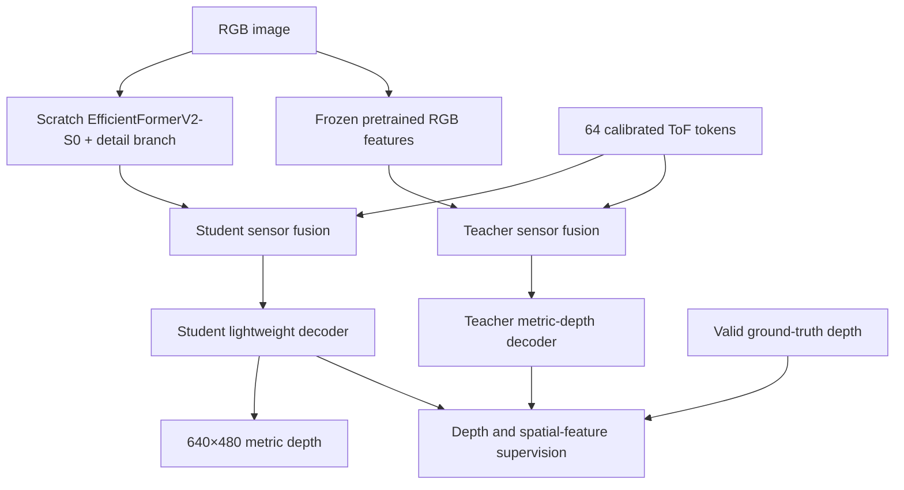

# RGB–ToF Teacher–Student Architecture Plan

Implementation status: the v4 teacher and baseline student remain available.
The current `student_v5` implementation uses a randomly initialized
EfficientFormerV2-S0 encoder, corrected confidence-aware distillation, a
dedicated configuration, TorchScript export, and regression tests. Accuracy
and iPhone latency remain experiment gates.

## Objective

Refactor the current depth-refinement network into a stronger RGB–ToF teacher and a lightweight mobile student. The teacher will learn the target sensor task using a frozen Depth Anything V2 RGB feature extractor. It will then transfer metric-depth predictions and intermediate spatial structure into the student.

Only the student will be deployed. The target student remains a single-pass model that produces a 640×480 metric-depth map from an RGB image and 64 calibrated ToF-zone tokens.

The primary research target is depth outside valid ToF coverage. Current validation analysis shows that approximately 90% of corrected squared error occurs in those regions.

## System overview



Training is divided into two stages:

1. Train an RGB–ToF teacher while keeping the pretrained RGB extractor frozen.
2. Freeze the trained teacher and distill its predictions and spatial features into the mobile student.

## Teacher architecture

### RGB feature extractor

- Use the cached Depth Anything V2 Large model as the pretrained RGB extractor.
- Freeze the backbone and feature neck, including normalization state.
- Execute the frozen portion under `torch.no_grad()` and keep it in evaluation mode.
- Convert its feature pyramid to full-image scales of 1/2, 1/4, 1/8, and 1/16.
- Project those features to 64, 96, 128, and 192 channels.

The existing Depth Anything prediction head is not used as the teacher output because it produces relative depth. A new RGB–ToF decoder will learn metric depth from ZJU-L5 ground truth and sensor measurements.

### ToF fusion

- Encode the existing 64×7 calibrated tokens containing mean, standard deviation, validity, rectangle center, and rectangle size.
- Pool RGB features inside each calibrated rectangle at 1/16 resolution.
- Concatenate the pooled appearance representation with the normalized sensor measurement and geometry.
- Project each combined token through a small MLP.
- Fuse tokens into the RGB pyramid at 1/16 and 1/8 resolution.
- Use attention dimension 64 with four heads: two geometry-biased heads and two global appearance heads.
- Preserve a learnable null token so the network can ignore unreliable measurements and safely handle an all-invalid sensor frame.

### Metric-depth decoder

- Decode with additive RGB skip connections.
- Use trainable projections at each teacher scale.
- Use a 16-channel full-resolution refinement head.
- Compute the global metric-depth anchor directly from valid ToF token means.
- Use 1 metre as the fallback anchor when every sensor token is invalid.
- Predict a residual relative to the anchor and apply a positive-output transformation.
- Return the final metric-depth prediction and fused features at 1/8 and 1/16 resolution for student distillation.

## Student V5 architecture

### Scratch EfficientFormerV2 RGB encoder

- Use the EfficientFormerV2-S0 architecture with random initialization.
- Never download or load ImageNet weights for the student.
- Resize RGB to a fixed 256×320 semantic input.
- Use S0 features with 32, 48, 96, and 176 channels at reductions 4, 8, 16,
  and 32 relative to the working image.
- Project and resize the pyramid into decoder widths 64, 96, and 128.
- Add a shallow full-image detail branch that supplies a 32-channel 1/4 skip.
- Train the complete encoder from epoch one.

The fixed working dimensions are divisible by 32. This avoids the odd-height
residual mismatch in EfficientFormerV2's stride-two attention while the depth
head still returns 640×480 output.

### V5 ToF fusion and decoder

- Retain calibrated 64×7 tokens and cross-attention at 1/16 and 1/8.
- Pool the RGB-only 1/16 decoder appearance once and reuse it at both fusion
  scales.
- Retain the learned null token, geometry-biased head, global head, and metric
  anchor.
- Decode to 1/4 with additive skips and retain the narrow eight-channel
  full-resolution refinement head.

The complete V5 model contains 3,393,614 parameters. The encoder architecture
adds RGB self-attention at coarse resolution; it does not replace sensor
cross-attention.

### Corrected V5 teacher transfer

Teacher confidence is `exp(-abs(teacher-target)/0.25)`. The corrected depth
loss divides by valid coverage weight without including confidence in the
denominator, so low confidence reduces the teacher's absolute gradient.
Feature supervision uses area-pooled valid coverage and confidence maps.

Epochs 1–5 use ground truth only. Teacher depth and feature supervision ramp
during epochs 6–10 and remain at full configured weight afterward.

## Student V4 architecture

### RGB encoder

- Accept RGB at 640×480 and resize internally to 320×240.
- Use depthwise-separable encoder stages with 32, 64, 96, and 128 channels.
- Relative to the original input, encoder outputs occur at 1/4, 1/8, 1/16, and 1/32 resolution.
- Retain inexpensive channel context at the bottleneck.

### ToF fusion

- Use the same token and footprint-pooling design as the teacher, with separate student weights.
- Fuse sensor information at 1/16 and 1/8 resolution during decoding.
- Use attention dimension 32 with two heads: one geometry-biased head and one global appearance head.
- Preserve invalid-token masking and the null token.

### Lightweight decoder

- Decode only to 1/4 resolution with additive skip connections.
- Project decoder features to eight channels before full-resolution upsampling.
- Concatenate the upsampled features with full-resolution RGB.
- Apply one depthwise-separable refinement block and a one-channel depth head.
- Use the token-derived global depth anchor and predict a positive metric-depth residual.

This design moves most computation away from 640×480 resolution. The current full-resolution refinement block alone accounts for approximately 0.441G MACs, so this change is expected to provide the largest deployment saving.

## Shared model interfaces

The new core interfaces will be:

```python
student(image, tof_tokens) -> depth
teacher(image, tof_tokens) -> depth

# Training and diagnostics only
model(image, tof_tokens, return_aux=True) -> DepthOutput
```

`DepthOutput` will contain:

- `depth`: full-resolution metric-depth prediction;
- `feature_1_8`: fused feature map at 1/8 resolution;
- `feature_1_16`: fused feature map at 1/16 resolution.

Deployment input and output shapes:

| Value | Shape |
| --- | --- |
| RGB image | `B×3×480×640` |
| Calibrated ToF tokens | `B×64×7` |
| Metric-depth output | `B×1×480×640` |

The previous three-input model signature will remain available through a compatibility wrapper. The full-resolution ToF raster will not be required by the new student.

## `model/` refactor

Split the current `model.py` implementation by responsibility:

| File | Responsibility |
| --- | --- |
| `model/blocks.py` | Convolution, normalization, depthwise-separable blocks, and channel context. |
| `model/rgb.py` | Mobile V4 encoder, scratch EfficientFormerV2 V5 adapter, and frozen teacher pyramid. |
| `model/tof.py` | Token validation, footprint pooling, token encoding, and sensor attention. |
| `model/decoder.py` | Additive decoder blocks and metric-depth heads. |
| `model/teacher.py` | Pretrained RGB extractor, teacher fusion, and teacher decoder composition. |
| `model/legacy.py` | Existing attention-v3 architecture with preserved checkpoint parameter names. |
| `model/model.py` | New student composition and public compatibility aliases. |

Distillation losses and feature adapters belong in the training subsystem. They must not be registered inside the deployable student.

Add explicit architecture selection:

- `attention_v3`: existing model and checkpoint contract;
- `teacher_v4`: new frozen-backbone RGB–ToF teacher;
- `student_v4`: new mobile student.

Teacher dependencies must load lazily so student-only inference does not require Transformers or teacher weights.

## Dataset and evaluation correction

Before comparing architectures, change target validity construction so depths outside the configured range are excluded rather than clipped to 10 m and marked valid.

Maintain the old evaluation only as a separately labelled legacy metric. Report both image-averaged and pixel-pooled results for the corrected protocol. Use the corrected protocol for model selection and all teacher–student comparisons.

## Stage A: train the teacher

Train only the teacher channel projections, token encoder, fusion modules, and metric-depth decoder. The pretrained RGB backbone and neck remain frozen.

Use the following losses:

| Loss | Weight |
| --- | ---: |
| Masked metric MSE | 1.0 |
| Log-depth gradient loss at offsets 1, 2, and 4 | 0.1 |

Gradient supervision uses only pairs whose two target endpoints are valid.

Default optimization:

- 30 epochs;
- AdamW;
- learning rate `3e-4`;
- three warm-up epochs;
- cosine decay;
- mixed precision on CUDA;
- best-checkpoint selection by corrected validation RMSE.

Advance to student distillation only if the teacher improves both overall RMSE and outside-coverage RMSE over the strongest corrected baseline.

## Stage B: distill into the student

Freeze the completed teacher. Train the student using ground truth plus teacher supervision.

| Loss | Purpose | Initial weight |
| --- | --- | ---: |
| Ground-truth metric MSE | Absolute metric accuracy | 1.0 |
| Ground-truth log-depth gradient loss | Depth boundaries | 0.1 |
| Teacher-depth Smooth L1 | Transfer metric predictions | 0.5 |
| Spatial-feature cosine loss | Transfer scene structure | 0.05 |

Use training-only 1×1 feature adapters to align student channels with teacher features at 1/8 and 1/16 resolution. Teacher predictions and features are detached.

Distillation weighting:

- Assign an initial weight of 2.0 outside valid ToF footprints and 1.0 inside them.
- Normalize coverage weights before applying teacher confidence.
- At valid target pixels, compute detached teacher confidence as `exp(-abs(teacher - target) / 0.25)`.
- Exclude invalid target pixels from the first implementation of distillation.
- Train for five epochs with ground-truth losses only.
- Ramp the teacher-loss weights from zero to their configured values during epochs 6–10.
- Keep the full weights for the rest of the 60-epoch student schedule.

Run the frozen teacher online during distillation so RGB augmentation and flipped token geometry remain aligned. Begin with batch size one on the RTX 4070 Ti.

## Required ablations

Use identical data splits, corrected evaluation, schedules, and seed handling.

1. Retrained attention-v3 baseline.
2. Student architecture trained only with ground truth.
3. Student plus teacher-depth supervision.
4. Student plus depth and feature supervision.
5. Full student plus outside-coverage weighting.
6. Full student with one fusion scale instead of two.
7. Teacher with sensor fusion disabled.
8. Student with appearance pooling disabled.

Confirm the final candidates across scene-disjoint development folds and seeds 42, 43, and 44. Do not use the held-out test scenes for architecture selection.

## Tests and verification

Inspect parameter counts and parameter-plus-buffer storage for each v4 model
with:

```bash
python main.py --config configs/teacher_v4.yml --para-summary
python main.py --config configs/student_v4.yml --para-summary
python main.py --config configs/student_v5.yml --para-summary
python benchmark_student.py --config configs/student_v5.yml
```

The reported storage uses `summary.parameter_dtype` from the selected config
and excludes activations, gradients, optimizer state, runtime overhead, and
input/output buffers. Deployment-memory acceptance therefore still requires a
runtime measurement on the target phone.

- Frozen teacher RGB weights receive no gradients.
- Teacher fusion, decoder, and student parameters receive finite gradients.
- Invalid tokens cannot change predictions.
- All-invalid token frames produce finite results.
- Horizontal flips transform token geometry and teacher supervision consistently.
- Old attention-v3 checkpoints reproduce their existing outputs.
- `return_aux=False` returns only the depth tensor for deployment.
- The exported student contains no teacher or distillation-adapter parameters.
- Exported and PyTorch student predictions agree within the selected precision tolerance.
- Parameter, MAC, activation-memory, and latency reports include preprocessing.

Report overall, inside-coverage, outside-coverage, and depth-bin metrics using RMSE, MAE, AbsRel, delta-1, and depth-boundary accuracy.

## Promotion criteria

The new student is accepted only if it satisfies all of the following:

| Criterion | Target |
| --- | ---: |
| Overall corrected RMSE improvement | At least 5% |
| Outside-coverage RMSE improvement | At least 10% |
| Student parameters | Report model and storage; no fixed cap |
| Student convolution/attention MACs | Report at deployment input size |
| Output resolution | 640×480 |
| Phone inference latency | p95 at most 33 ms |
| Incremental phone inference memory | At most 128 MiB |

The phone latency target applies to model computation. The external VL53L5CX provides fresh 8×8 sensor frames at up to 15 Hz and must be reported separately from model throughput.

## Research claim to test

The central claim is not simply the use of a teacher, attention, or distillation. The experiments must test whether **coverage-aware transfer from an RGB–ToF teacher, combined with appearance-enriched calibrated sensor tokens, improves depth outside sensor coverage while preserving a mobile inference budget**.

No accuracy improvement is claimed until the controlled experiments and mobile deployment checks pass.
